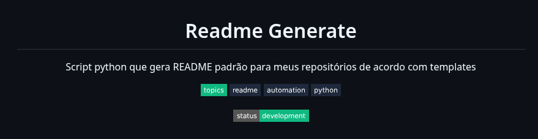

<!--
template_name=header-code
template_version=v1
-->

<h1 align="center" style="color:#F1F5F9;">
  Readme Generate
</h1>

  
    Script python que gera README padrão para meus repositórios de acordo com templates
  

        

  

  
    🛠️ Actively worked on. New features may come and things can change.
  

## Atualmente uso as seguintes templates
 - [Header default v1](templates/header-default-v1.md)
 - [Header code v1](templates/header-code-v1.md)
 - [Stack default v1](templates/stack-default-v1.md)
 - [footer default v1](templates/footer-default-v1.md)

## Exemplos
### Header code v1

### Stack v1

### Footer v1

<!--
template_name=stack-default
template_version=v1
-->

<h2>⚙️ Tech Stack</h2>

---

**💾 Database** · **🔌 Protocols** · **🛠️ Tools**  
Persistence layer · Communication layer · Infrastructure & tooling

    

<!--
template_name=footer-default
template_version=v1
-->

---

  

---

  <strong style="font-size:16px;">Igor Moreira Alves</strong> 
  Back-end Software Engineer • Java • Python • Spring Boot • AWS

  
  
  

  
    Atualizado em 2026-02-05 19:17
  

